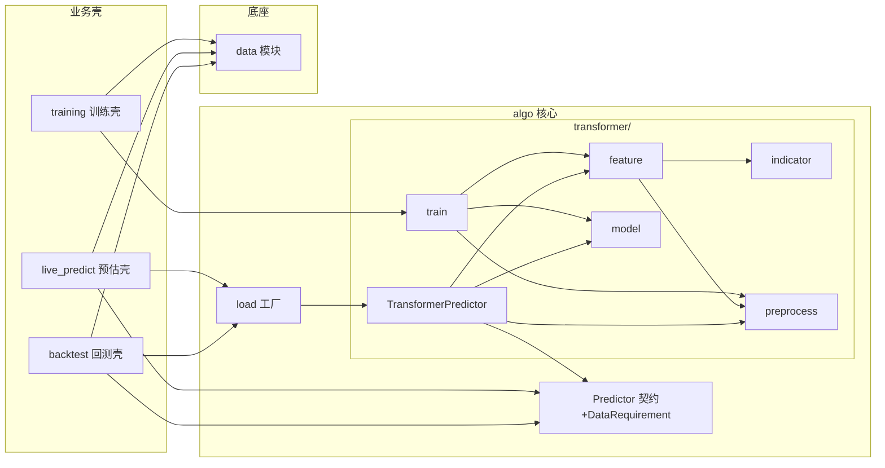

# 算法模块设计文档

## 1. 这模块干嘛的

把 OHLCV K 线喂给序列模型，输出"未来几根 bar 内会不会先涨/跌穿某阈值"的概率。是本项目的**核心模块**，设计上不走三层（CLI/Adaptor/Domain），而是**每类算法独立文件夹**，对外只暴露一个**预测类**。

参考 `transformer_user`（BTC 上 AUC 0.7）重写。第一类算法是双层 BertEncoder（`transformer/`），未来加算法（LSTM/Mamba 等）就开新文件夹。

**核心解耦点——数据需求结构体**：算法不直接调 `data`，而是通过 `data_requirement` 成员变量**声明**它要哪些标的的哪些信息（字段/频率/窗口/复权/额外表）。上层（`live_predict` 在线 / `backtest` 回测）拿这个声明去 `data` 取数，再喂给 `predict`。这样算法不绑数据模块，且**训练/推断/回测取数口径一致**（都按同一份 `data_requirement`）。

不做：数据获取（`data` 管）、训练调度与落盘业务（`training` 管）、信号转下单清单（`live_predict` 管）、撮合（`backtest` 管）。

## 2. 对外暴露什么

不是模块函数门面，是一个**预测类契约** + 一个加载工厂 + 一个数据需求结构体。`import algo` 拿到这三样：

### 2.1 预测类契约 `Predictor`（鸭子类型，不强制继承）

每类算法各自实现一个预测类，都遵守这个契约：

- `__init__(self, model_file: str)` — 加载指定模型文件初始化。入参模型文件路径；内部读权重+元数据，重建模型/预处理/特征函数/`data_requirement`，无返回。
- `predict(self, df: pd.DataFrame) -> pd.DataFrame` — 预测成员方法。入参符合 `data_requirement` 的 panel df（列含 `time/ts_code` + 所需字段，行数 ≥ window）；输出概率 panel df（列 `time/ts_code/prob_up`[, `prob_down`]），window 不足的时点不出。
- `data_requirement: DataRequirement` — 成员变量（实例属性，`__init__` 时从模型文件恢复）。说明本算法需要哪些标的的哪些信息，供上层取数。

### 2.2 加载工厂

- `load(model_file: str) -> Predictor` — 读模型文件元数据里的 `algorithm` 字段，动态定位到对应算法文件夹的预测类并构造。入参模型文件路径 → 就绪的 `Predictor` 实例。换算法不用改上层代码。

### 2.3 数据需求结构体 `DataRequirement`（详见 §3）

上层取数的唯一依据，序列化进模型文件随快照走。

> 训练不在对外契约里——训练是每类算法的离线过程（`<algo>/<算法名>/train.py`），由 `training` 模块或脚本调用，产模型文件；运行时（在线/回测）只 `load` + `predict`。

## 3. 数据需求结构体 `DataRequirement`（核心设计）

算法声明"我要什么"，上层据此取数。设计目标：**一份声明同时驱动在线与回测取数，且与训练时同口径**。

```python
@dataclass
class DataRequirement:
    codes: List[str]                       # 需要哪些标的（训练用的标的集合，推断/回测同集合）
    fields: List[str]                      # 需要哪些原始字段（如 ["open","high","low","close","volume"]）
    freq: str                              # 频率（"min1" | "day"）
    window: int                            # 预测所需历史窗口长度（bar 数，预测某时点需取截止该时点的 window 根）
    adjust: str                            # 复权方式（"qfq" | "hfq" | "none"）
    extras: Dict[str, List[str]] = {}      # 额外表需求：键=表名(adj_factor/daily_basic...)，值=所需字段
```

**在线怎么用**（`live_predict`）：`predictor = algo.load(model_file)` → 读 `req = predictor.data_requirement` → 向 `data` 取 `req.codes` 的 `req.fields`、`freq=req.freq`、最近 `req.window` 根 bar、`adjust=req.adjust`、外加 `req.extras` → 喂 `predictor.predict(df)` → 最新时点概率 → 信号清单。

**回测怎么用**（`backtest`）：同样 `load` + 读 `req` → 向 `data` 取整个回测区间的 panel（同口径）→ 按 bar 滚动窗口喂 `predict`（或一次性喂全量、内部滚动）→ 每个时点概率 → 策略撮合。

**训练怎么用**（`training` 调 `<算法>/train.py`）：训练时把标的/字段/频率/窗口/复权写进 `DataRequirement`，随模型文件落盘。从此 `load` 出来的 `predictor.data_requirement` 就是训练口径，保证三者一致。

> `extras` 是为算法特征用到非行情表的情况（如复权因子、每日指标）。不用的算法留空 dict。

## 4. 每类算法文件夹结构（以 `transformer/` 为例）

每类算法一个文件夹，内部维护该算法的指标函数、特征函数、预处理、模型、训练、预测类——自成一体，互不干扰。

```
algo/
├── predictor.py          # 根：Predictor 契约(Protocol) + DataRequirement + load 工厂
├── __init__.py           # 暴露 Predictor / DataRequirement / load
├── README.md             # 本文件
├── transformer/          # 第一类算法：双层 BertEncoder（AUC 0.7 那版）
│   ├── indicator.py      # 该算法的指标函数（108 K线指标 + 涨跌幅，numba 加速降级 pandas）
│   ├── feature.py        # 该算法的特征函数（指标+涨跌幅 merge → dropna → 推离散/连续）
│   ├── preprocess.py     # 该算法的预处理（FieldMeta/DiscreteCollector/词表/标准化/缺失 mask）
│   ├── model.py          # 该算法的模型架构（nn.Module：EmbeddingModule + 双层 BertEncoder + 分类头）
│   ├── train.py          # 该算法的离线训练过程（接 df → 特征 → 预处理 → 训练 → 落模型文件）
│   └── predictor.py      # 该算法的预测类 TransformerPredictor（实现根 Predictor 契约）
└── （未来 lstm/、mamba/ ... 各自一个文件夹，同构）
```

各文件职责（概括 + 缺失后果）：

- `indicator.py`：108 个 K 线指标(EMA/RSI/MACD/ATR/布林/KD/CCI/威廉/TRIX/PPO/UO 等)+涨跌幅，numba 加速、无 numba 降级 pandas。**没它**：特征工程没原料，模型只能吃裸 OHLCV，表达力塌。
- `feature.py`：把指标+涨跌幅 merge 成特征表，dropna，调 `preprocess` 推离散/连续。**没它**：指标散落，模型输入 schema 不固定，每实验各自拼特征。
- `preprocess.py`：`FieldMeta`/`DiscreteCollector`/`ProcessInfo`，建离散词表+连续均值方差，产出预处理函数(行 dict → index/mask/value)。**没它**：离散/连续没统一处理，缺失没 mask，embedding 维度对不上。
- `model.py`：`WholeTransformer`（`nn.Module`）——`EmbeddingModule`(离散 embedding + 连续经 v/b1/w/b2 变换 + transform_matrix 聚合) → `compress_token`+Bert 压成单 token → 位置编码 → seq Bert + `clf_token` → Linear 分类头。对应 `transformer_user` AUC 0.7 那版。**没它**：没模型本体。
- `train.py`：训练循环(AdamW + BCEWithLogits + cosine warmup + TensorBoard)，组合 feature/preprocess/model，落可复现模型文件。**没它**：训练逻辑散在脚本，复现无保证。
- `predictor.py`：`TransformerPredictor` 实现 `Predictor` 契约——`__init__` 读模型文件重建(模型/预处理/特征函数/data_requirement)，`predict(df)` 跑特征→预处理→前向→sigmoid。**没它**：算法没法被上层加载调用，在线/回测没法推断。

## 5. 模型文件存什么 + load 流程

打比方：模型文件是"可复现的算法包裹"——权重 + 重建所需的全部配方。`load` 照配方重建，不靠 pickle 闭包（闭包跨环境即崩、不可读）。

目录布局（路径相对 `algo/` 目录解析，不依赖 cwd）：

```
snapshots/<name>/
├── model.pt              # 权重
├── meta.yaml             # algorithm=transformer / 模型超参 / FieldMeta 统计量 / 特征列 / 标签配置 / DataRequirement / 指标库版本
├── feature_cols.txt      # 特征列顺序(保证 load 列对齐)
└── runs/<name>_train/    # TensorBoard 日志
```

**load 流程**（`algo.load`）：读 `meta.yaml` 的 `algorithm` 字段 → `import algo.<algorithm>.predictor` → 用 `model_file` 路径构造对应 `Predictor` → 实例的 `__init__` 按 meta 重建模型骨架/预处理函数/特征函数/`data_requirement` + 加载 `model.pt` 权重 → 返回就绪实例。全程无 `cloudpickle`，可读、可跨环境、可复现。

**对比 transformer_user**：原版 `algo_pack` 用 `cloudpickle.dump(feature_function)` 存闭包，函数体变了快照即废、跨环境加载失败。本模块把"造特征的配方"抽成可序列化元数据，函数本身是算法文件夹里的固定函数（按元数据参数化），不随快照序列化。

## 6. 训练流程（离线，由 `training` 调 `<算法>/train.py`）

1. `training` 从 `data` 取训练/验证 df（OHLCV panel）。
2. 调 `algo.transformer.train.train(train_df, val_df, name, data_requirement)`：
   - `feature.py` 算特征 → `preprocess.py` 建 FieldMeta + 预处理函数 → `model.py` 构模型。
   - AdamW + BCE + cosine warmup 训练，每 epoch 存权重，TensorBoard 记录。
   - 落模型文件：权重 `.pt` + `meta.yaml`（含传入的 `data_requirement`，从此快照自带数据口径）。
3. 返回模型文件路径。

> `data_requirement` 由 `training` 根据训练用的标的/字段/频率/窗口组装传入，训练只管落盘。这样"训练用什么数据"由业务壳决定并固化进快照，推断/回测严格遵循。

## 7. 依赖关系



方向单向。业务壳（training/live_predict/backtest）经 `load` + `Predictor` 契约用算法，不直接碰算法文件夹内部（换算法不影响业务壳）。`data` 只被业务壳调，算法不 import `data`——算法只通过 `DataRequirement` 声明需求，取数由业务壳完成。`training` 是唯一同时碰算法训练入口和 `data` 的地方（喂数据 + 调训练）。

## 8. 配置（`algo/config.yaml`）

位置是模块内部的事，`config.py`（若需）用 `__file__` 自定位，不依赖运行目录。每类算法的超参也可各自放 `<算法>/config.yaml`，第一版先统一在 `algo/config.yaml`：

```yaml
algo:
  snapshot_dir: "snapshots"     # 快照根目录(相对 algo 目录解析)
  device: "cuda"                # cuda | cpu
  numba: false                  # 指标库 numba 加速(无则降级 pandas)

transformer:                    # transformer 算法超参
  dim: 64
  batch: 32
  seq_len: 120
  num_hidden_layers: 4
  num_attention_heads: 8
  intermediate_size: 512
  bin_num: 10
  lr: 0.00003
  epoch: 20
  warmup_ratio: 0.05
  weight_decay: 0.01
  label_mode: "binary"          # binary | multi7
  label_k: 10
  label_up: 1.01
  label_down: 0.991
```

## 9. 依赖（需补装，环境现缺）

除已装(torch/numpy/pandas)外还需：

- `transformers` — `BertEncoder`/`BertConfig`/`get_cosine_schedule_with_warmup`（首版沿用，模型已验证 AUC 0.7）。
- `tensorboard` — 训练日志。
- `tqdm` — 进度条。
- `scikit-learn` — `roc_auc_score` 评估。
- `numba`（可选）— 指标库加速，无则降级 pandas。

> 由领导执行 `/root/anaconda3/envs/ldm/bin/pip install`，agent 不自行安装。`requirements.txt` 实现时同步。

## 10. 对 transformer_user 的改造点

| transformer_user 问题 | 本模块做法 |
|---|---|
| 特征/标签/模型/训练/推断混在 `pack_exp*.py` 全局变量 | 每类算法独立文件夹，文件分指标/特征/预处理/模型/训练/预测类 |
| `cloudpickle` 存函数闭包(跨环境崩、不可读) | 模型文件存 `meta.yaml`+权重，`load` 按元数据重建 |
| 硬编码 `DIM/BATCH/LEN/NAME` 散落 | 进 `config.yaml` |
| 接 csv + 全局 `train_df` | 接 df 入参（业务壳传入），不读文件 |
| `.cuda()` 硬绑 GPU | `device` 由 config 控制 |
| 算法直接调数据 | 不 import `data`，靠 `DataRequirement` 声明需求，业务壳取数 |
| 指标库与实验耦合 | `transformer/indicator.py` 独立 |
| 模型架构不可换、训练/推断不分 | 每类算法独立文件夹；对外只暴露预测类契约，训练是文件夹内离线过程 |
