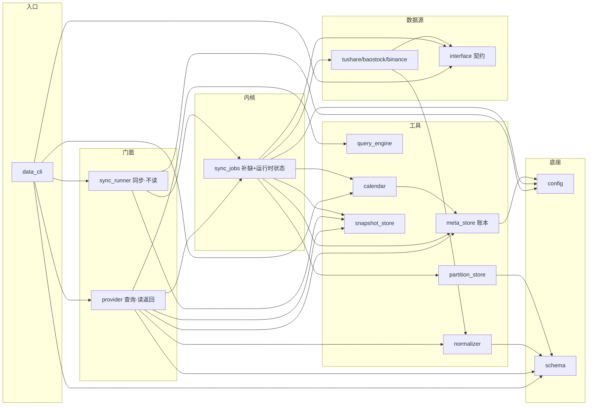

# 数据模块设计文档

## 1. 这模块干嘛的

给你要的行情数据。你说"要 600900 近一周小时线"，它给你一张表，你不用管数据从哪来、存哪、要不要上网拉。

两条路用：
- **查询（import 就能用）**：`provider.hour(["600900.SH"], 开始, 结束)` 直接拿数据。本地有就读本地，没有就自动上网拉，拉回来存本地，下次直接读本地。这些你都不用管。
- **同步（可选，提前拉好）**：`sync_runner.daily(...)` 批量提前拉好存着。要不要定期跑你定（用 cron 或脚本触发），模块不管定时。不跑也行，查询那条路自己会兜底。

不做特征/策略/下单，只搬数据。时间用北京整分钟右闭；粒度 1min + 日线，5/15/30/60min 由最细粒度现聚合不单独存。

## 2. 对外能调啥（`data_cli.py`）

`import data` 就能用全部。两个面，加载即用、无 `init()`：运行时状态在首次调用时自己组装，配置自己找同目录的 `config.yaml`，不依赖运行目录。

### 2.1 查询面（`from data import provider`）—— 按需回源兜底，对上层无感

行情：
- `minute(codes, start, end, adjust="qfq")` — 分钟 OHLCV，盘中分析用。入参标的列表+起止日+复权 → 分钟 bar df；本地缺自动回源补齐，复权查询层拼。
- `hour(codes, start, end, adjust="qfq")` — 小时线，大粒度看盘用。入参同 `minute` → 60min df；由 1min 现聚合不落库。
- `daily(codes, start, end, adjust="qfq")` — 日线，日级回测/训练用。入参同 `minute` → 日线 bar df；本地缺自动回源补齐，复权查询层拼。
- `latest_bar(codes, freq="min1")` — 最新一根 bar，实盘信号用。入参标的列表+频率 → 每标的最新 bar df；补近 10 日读本地取尾。

A 股辅助表：
- `daily_basic(codes, start, end)` — 每日指标(市值/估值/换手)，选股/因子用。入参标的列表(可 None 全市场)+起止日 → 横截面 df；本地缺自动回源补齐。
- `adj_factor(codes, start, end)` — 复权因子，复权计算用。入参标的列表+起止日 → 复权因子 df；本地缺自动回源补齐。
- `stk_limit(date)` — 当日涨跌停价，撮合/过滤用。入参日期 → 涨跌停 df；本地缺自动回源补齐。
- `stock_st(date)` — 当日 ST 列表，标的过滤用。入参日期 → ST df；本地缺自动回源补齐。
- `suspend_d(date)` — 当日停复牌，撮合/过滤用。入参日期 → 停复牌 df；本地缺自动回源补齐。

元信息：
- `trade_cal(start, end, exchange="SSE")` — 交易日历，判断哪天该拉数据用。入参起止日+交易所 → 日历 df；本地 DuckDB 缺则就绪阶段已补。
- `stock_list(sec_type=None)` — 可买标的清单，遍历标的用。入参类别(可 None 全部) → 清单 df；本地无快照则回源拉取，有则直读(刷新走 sync)。
- `is_trading_day(date, exchange="SSE")` — 是否交易日，流程控制用。入参日期+交易所 → bool；本地缺则就绪阶段已补。

导出 / 收尾：
- `export(codes, start, end, freq="day", fields=None, adjust="qfq")` — 训练唯一交接点，导出干净面板。入参标的列表+起止日+频率+字段+复权 → 列对齐模型输入的 df；freq 取 `min1`/`min60`/`day`。
- `close()` — 释放连接重置就绪状态，进程退出或重组装用。无入参 → None。

### 2.2 同步面（`from data import sync_runner`，`data_cli` 导出加 `sync_` 前缀避免撞名）—— 显式预热，只落库不返回

- `sync_minute(codes, start, end)` — 预热分钟线，定期批量用。入参标的列表+起止日 → None；只落库不返回 df。
- `sync_daily(codes, start, end)` — 预热日线。入参同 `sync_minute` → None。
- `sync_daily_basic(start, end)` — 预热每日指标(全市场横截面)。入参起止日 → None。
- `sync_adj_factor(codes, start, end)` — 预热复权因子。入参标的列表+起止日 → None。
- `sync_stk_limit(date)` — 预热当日涨跌停。入参日期 → None。
- `sync_stock_st(date)` — 预热当日 ST。入参日期 → None。
- `sync_suspend_d(date)` — 预热当日停复牌。入参日期 → None。
- `sync_trade_cal(start, end, exchange="SSE")` — 强制刷新交易日历区间(节假日调整用)。入参起止日+交易所 → None；upsert 不丢其他区间。
- `sync_stock_list(sec_type="stock")` — 刷新标的清单快照(全量覆盖)。入参类别 → None；多类别改 config 后重新触发。
- `sync_all(codes=None, start=None, end=None)` — 全量预热所有表。入参标的列表(可 None 取 basic)+起止日(可 None 取 first_date/今日) → None；顺序 trade_cal→basic→行情→辅助表。

> `hour` 无同步版——小时线由 1min 聚合，同步分钟线即可。同步面函数名与查询面对称。

## 3. 数据从哪来（`datasource/`）

只有这层知道外面数据源长啥样。换源就加个实现文件，存储查询都不用动。

- `interface.py`：规定数据源必须有哪些方法（拉分钟/拉日线/拉清单/拉日历），鸭子类型不强制继承。
- `tushare.py`：tushare 实现，付费要 token。
- `baostock.py`：baostock 实现，免费。**限制**：没有 1min（最细 5min），没有 A 股辅助表（涨跌停/ST/停牌那些）。
- `binance.py`：币安，预留没实现。

## 4. 各文件干嘛的（平铺在 `data/` 根）

> 约定：工具/单例都用 `.py` 文件装函数和状态，不写 Class；只有需要多态的（日历、数据源）和数据记录（StandardBar/SyncTask）才用 Class。加载就能用，没有 init。

- `schema.py`：定字段名和常量（频率/复权/标的类别）。**没它**：各层字段名各写各的，归一化和查询对不上，换源就崩。
- `config.py`：读 `config.yaml` 配置，用 `__file__` 自己找同目录的配置文件，不依赖你从哪运行。**没它**：各模块各自读配置（重复）或被迫从入口传配置路径（暴露内部布局）。
- `calendar.py`：交易日历，区分 A 股（工作日开盘）和 BTC（7×24 无休）。多态保留 Class。**没它**：不知道哪天该拉数据、哪天是交易日、分钟 bar 没法按交易时段裁。
- `normalizer.py`：把各数据源原始数据转成统一格式（时区/时间戳/字段名/代码差异在这吸收），还管复权和分钟聚合。**没它**：每个数据源都得自己处理时区列名，存储查询被迫感知数据源，三段式解耦失败。
- `partition_store.py`：行情按"标的/日期"分文件夹存（双层，给分钟/日线/复权因子）或按"日期"分文件夹存（单层，给当日全市场的横截面表如涨跌停/ST）。**没它**：没有统一存法，查单标的快不起来。
- `snapshot_store.py`：全量数据单文件覆盖存（标的清单这种）。**没它**：清单类数据只能塞分区表，全量更新成本高、语义也不对。
- `meta_store.py`：DuckDB 小本本，记两件事——①各表数据拉到哪天了 ②哪天是交易日。**没它**：不知道缺啥（每次都得全量拉）、日历没索引。
- `query_engine.py`：用 DuckDB 直读 Parquet，只扫你要的那几块（谓词下推），不回源。**没它**：查询变全盘扫描，单标的查不到毫秒级。
- `sync_jobs.py`：补缺内核。持有运行时状态（数据源/日历/各表配置），给定标的+区间只拉本地缺的部分，拉完落库记进度。被查询面和同步面共用。**没它**：补缺循环/重试/跳过已存在逻辑没处放，两个面没法解耦。
- `provider.py`：查询门面。每个函数 = 补缺 + 读本地 + 复权聚合 → 返回表。没有 sync/refresh/status 入口（违反"对上层无感"）。**没它**：上层得自己判断本地有没有、手动拉、自己拼，模块边界漏光。
- `sync_runner.py`：同步门面，跟查询面对称。每个函数 = 补缺（不读返回）。没有定时器（环境没 apscheduler，定期你用 cron 跑）。**没它**：没有显式预热入口，定期同步得各自写脚本，复用补缺内核没统一对外面。

## 5. 谁依赖谁



方向单向，没循环。两个门面共用 `sync_jobs` 内核，差异只在 `provider` 多读本地返回、`sync_runner` 不读。越往右越底层：入口 → 门面 → 内核 → 工具/数据源 → 底座。

## 6. 数据怎么存怎么查

打个比方：`market_data` 是存货的仓库，`db` 是记账的账本。查数据先翻账本知道缺啥，再去仓库取，缺的才上网拉。

- 行情（per 标的时序，双层分区）：`market_data/minute_kline|daily_kline|adj_factor/ts_code=XXXX/date=YYYYMMDD/data.parquet`
- 横截面（per 交易日全市场，单层分区）：`market_data/daily_basic|stock_st|suspend_d|stk_limit/date=YYYYMMDD/data.parquet`
- 标的清单（全量快照，单文件）：`market_data/basic.parquet`
- 账本（DuckDB）：`db/meta.duckdb`，两张表——`sync_meta`（各表拉到哪天）+ `trade_cal`（交易日历）

**查询流程**：翻账本看缺啥 → 缺的去网上拉 → 归一化 → 存仓库 → 记账本 → 读仓库返回。命中（仓库已有）就直接读不拉。
**同步流程**：只做"翻账本→缺的拉→存仓库→记账本"，不读返回。

路径都相对 data 目录解析，不依赖你从哪运行。

## 7. 配置（`data/config.yaml`）

位置是模块内部的事，`config.py` 自己找，不依赖运行目录。

```yaml
data:
  source: "baostock"            # 数据源（tushare | baostock | binance），换源改这
  tushare_token: "xxx"          # tushare 才要，baostock 免费
  data_dir: "market_data"       # 仓库目录（相对 data 目录解析）
  db_path: "db/meta.duckdb"     # 账本路径（相对 data 目录解析）
  fetch_interval_sec: 0.2       # 接口限速间隔（tushare 用）
  retry_delays: [5, 15, 45]     # 拉失败重试间隔（秒）
  first_date: "20160101"        # 默认回填起点
  exchange: "SSE"               # 默认交易所（日历查询用）
  basic_sec_type: "stock"       # 标的清单默认类别（stock | etf | cb）
```
